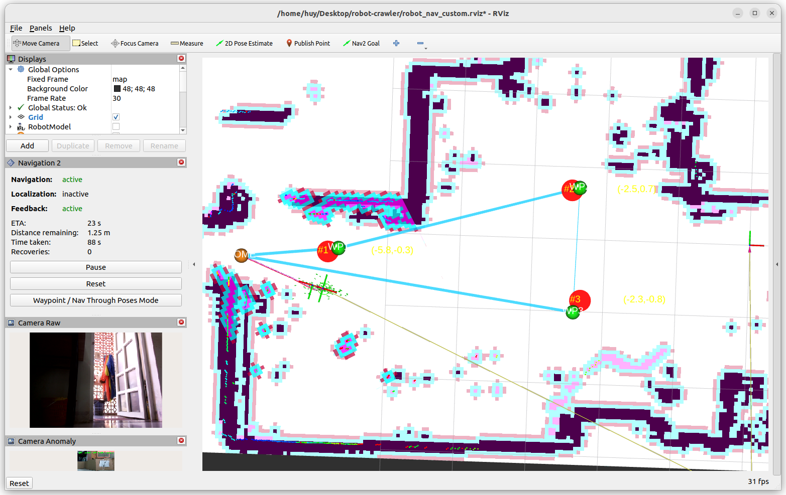
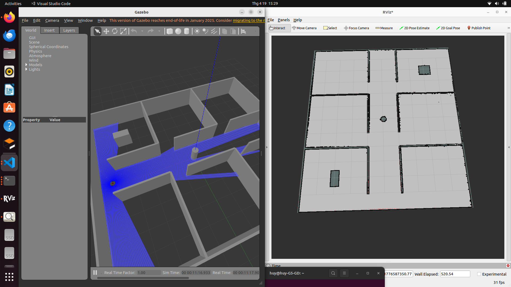
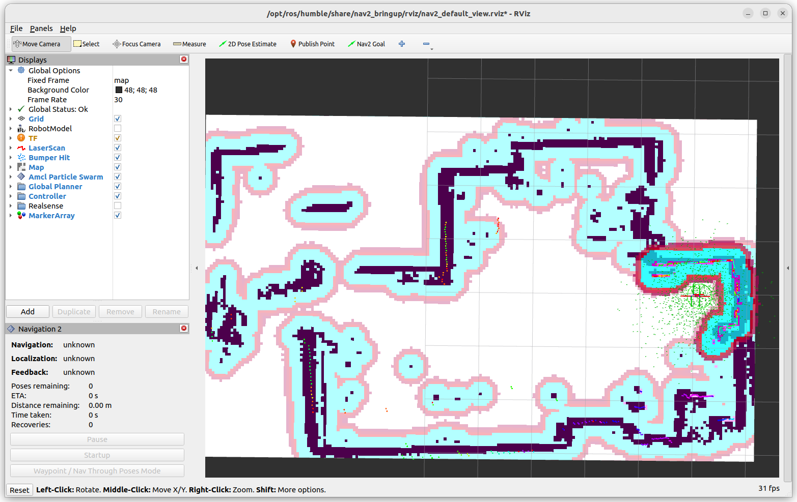
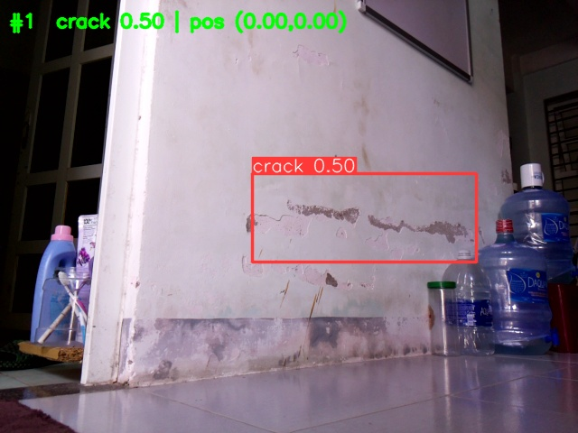
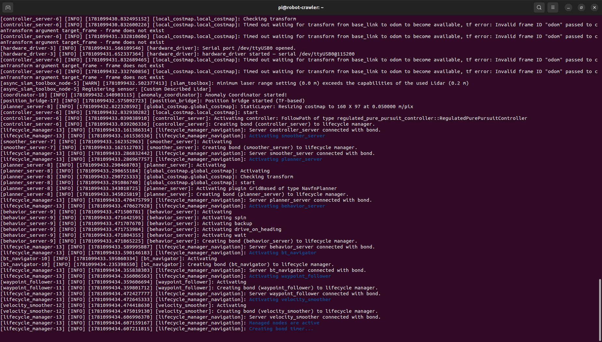

# 🤖 Autonomous Crack-Detection Crawler Robot

> **ROS 2 Humble** autonomous mobile robot for structural surface inspection, combining **SLAM-based navigation** with **YOLOv8 real-time crack detection** — built as a Capstone/Graduation Project.

<p align="center">
  
</p>

---

## 🚀 Project Highlights

✅ **Autonomous Navigation** — Nav2 stack with SLAM Toolbox & AMCL localization  
✅ **Real-time Crack Detection** — YOLOv8n model (mAP50 = 0.985) running on Raspberry Pi 4  
✅ **Custom Firmware** — Arduino Mega with PID motor control & IMU fusion  
✅ **Differential Drive** — BTS7960 dual H-bridge, encoder feedback at 20 Hz  
✅ **Multi-threaded Architecture** — Non-blocking YOLO inference on constrained hardware  
✅ **Full ROS 2 Pipeline** — From sensor drivers → SLAM → Nav2 → AI detection → alert system  

---

## 🏗️ System Architecture

```
┌─────────────────────────────────────────────────────────────────────┐
│                        Raspberry Pi 4 (ROS 2 Humble)                │
│                                                                     │
│  ┌──────────┐  ┌──────────────┐  ┌──────────────┐  ┌────────────┐ │
│  │ RPLiDAR  │  │  SLAM        │  │   Nav2       │  │  YOLOv8n   │ │
│  │ A1 Node  │─▶│  Toolbox     │─▶│  Navigation  │  │  Anomaly   │ │
│  │ /scan    │  │  /map        │  │  /cmd_vel    │  │  Detector  │ │
│  └──────────┘  └──────────────┘  └──────────────┘  └────────────┘ │
│       ▲                                    │              ▲        │
│       │              Serial USB            ▼              │        │
│  ┌────┴──────────────────────────────────────────────────┴────┐   │
│  │                    Hardware Driver Node                     │   │
│  │             /odom  /imu  /joint_states                     │   │
│  └─────────────────────────┬──────────────────────────────────┘   │
│                             │                                      │
└─────────────────────────────┼──────────────────────────────────────┘
                              │ Serial (115200 baud)
                    ┌─────────┴─────────┐
                    │   Arduino Mega     │
                    │   ┌─────────────┐  │
                    │   │ PID Control │  │
                    │   │ Encoder ISR │  │
                    │   │ MPU6050 IMU │  │
                    │   └─────────────┘  │
                    │   BTS7960 Drivers   │
                    └───────────┬────────┘
                          ┌─────┴─────┐
                          │ DC Motors  │
                          │ (L + R)   │
                          └───────────┘
```

---

## 🛠️ Hardware Components

| Component | Specification | Role |
|-----------|--------------|------|
| **Raspberry Pi 4** (4 GB) | Ubuntu 22.04 + ROS 2 Humble | Main compute board |
| **Arduino Mega 2560** | ATmega2560 @ 16 MHz | Low-level motor & sensor control |
| **RPLiDAR A1** | 360° scan, 12 m range | 2D LiDAR for SLAM & navigation |
| **MPU6050** | 6-axis IMU (I²C) | Orientation & angular velocity |
| **BTS7960** × 2 | 43A dual H-bridge | Motor driver (L/R) |
| **DC Gear Motors** × 2 | With Hall encoders | Differential drive |
| **USB Camera** | 640×480 | Visual crack detection |
| **Pan-Tilt Servo** | SG90 × 2 | Camera orientation |

---

## 📦 Project Structure

```
robot-crawler/
│
├── firmware/                          # 🔧 Arduino firmware
│   └── robot_firmware.ino             #    PID control, encoder ISR, IMU, serial protocol
│
├── robot_ws/                          # 🤖 ROS 2 Workspace
│   └── src/
│       ├── anomaly_detection/         #    YOLOv8 crack detection + coordinator
│       ├── robot_bringup/             #    Launch files + URDF robot model
│       ├── robot_hardware/            #    Serial driver ↔ Arduino communication
│       └── robot_navigation/          #    Nav2, SLAM, AMCL configs & launch files
│
├── models/                            # 🧠 Pre-trained models
│   └── best.pt                        #    YOLOv8n weights (crack, paint-off)
│
├── maps/                              # 🗺️ Saved navigation maps
│   ├── workshop_map.pgm
│   └── workshop_map.yaml
│
├── media/                             # 📸 Demo images & screenshots
├── .gitignore
└── README.md
```

---

## 📸 Demo & Results

### 🗺️ SLAM Mapping
<p align="center">
  
</p>

### 🧭 Autonomous Navigation (AMCL)
<p align="center">
  
</p>

### 🔍 YOLOv8 Crack Detection
<p align="center">
  
</p>

### 🖥️ System Logs — Full Pipeline
<p align="center">
  
</p>

---

## ⚙️ How to Build & Run

### Prerequisites
- **Raspberry Pi 4** with Ubuntu 22.04 + ROS 2 Humble
- **Arduino IDE** for firmware upload
- Python packages: `ultralytics`, `opencv-python`, `pyserial`

### 1. Clone the Repository
```bash
git clone https://github.com/PKHuy1455/robot-crawler.git
cd robot-crawler
```

### 2. Upload Arduino Firmware
```bash
# Open firmware/robot_firmware.ino in Arduino IDE
# Select Board: Arduino Mega 2560
# Upload
```

### 3. Build ROS 2 Workspace
```bash
cd robot_ws
colcon build --symlink-install
source install/setup.bash
```

### 4. Launch — SLAM Mode (Mapping)
```bash
ros2 launch robot_navigation navigation_slam.launch.py
```

### 5. Launch — Navigation Mode (With Saved Map)
```bash
ros2 launch robot_navigation navigation.launch.py map:=/path/to/maps/workshop_map.yaml
```

### 6. Launch — Full Autonomous Pipeline
```bash
ros2 launch robot_navigation full_auto.launch.py
```

### 7. Launch — Crack Detection
```bash
ros2 launch anomaly_detection anomaly_detector.launch.py
```

---

## 💡 Skills Demonstrated

| Category | Technologies |
|----------|-------------|
| **Robotics & ROS 2** | ROS 2 Humble, Nav2, SLAM Toolbox, AMCL, TF2, URDF |
| **Computer Vision & AI** | YOLOv8 (Ultralytics), OpenCV, model training & deployment |
| **Embedded Systems** | Arduino C++, PID control, encoder ISR, I²C (MPU6050) |
| **Linux & DevOps** | Ubuntu 22.04, systemd, SSH, Git |
| **Hardware Integration** | LiDAR, IMU, motor drivers, serial communication |
| **Programming** | Python, C++, ROS 2 launch system |
| **System Design** | Multi-threaded architecture, sensor fusion, real-time processing |

---

## 📬 Contact

I'm passionate about robotics and embedded systems! If you're a recruiter, hiring manager, or fellow developer — I'd love to connect.

| | |
|---|---|
| 📧 **Email** | [huyphan1455@gmail.com](mailto:huyphan1455@gmail.com) |
| 🔗 **LinkedIn** | [linkedin.com/in/phankhachuy](https://www.linkedin.com/in/phankhachuy/) |
| 💻 **GitHub** | [github.com/PKHuy1455](https://github.com/PKHuy1455) |

---

## 🙌 Acknowledgements

This project was developed as a **Capstone/Graduation Project** demonstrating the integration of autonomous navigation and AI-based structural inspection on a resource-constrained mobile robot platform.

---

<p align="center">
  <i>Built with ❤️ using ROS 2, YOLOv8, and Arduino</i>
</p>
